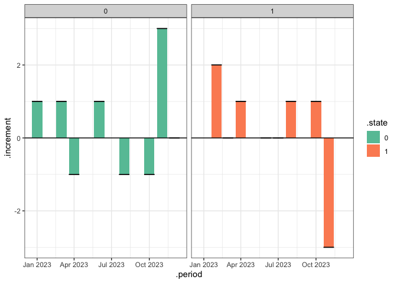

<!-- README.md is generated from README.Rmd. Please edit that file -->

# auditlogR

<!-- badges: start -->
<!-- badges: end -->

The goal of auditlogR is to …

Help you process audit log easier with R engine.

## Installation

You can install the development version of auditlogR from
[GitHub](https://github.com/) with:

``` r
# install.packages("devtools")
devtools::install_github("FzliangFrank/sandy-movement)
```

## Example

This package let you analysis audit log in a few simple syntax

``` r
library(sandystatus)
#> Loading required package: dplyr
#> 
#> Attaching package: 'dplyr'
#> The following objects are masked from 'package:stats':
#> 
#>     filter, lag
#> The following objects are masked from 'package:base':
#> 
#>     intersect, setdiff, setequal, union
## basic example code
```

``` r
my_log = make_fakelog(5, 7, 0)
my_log
#>    id from to    logtime weight
#> 1   1   NA  1 2023-02-23  10.86
#> 2   1    1  0 2023-11-06  11.95
#> 3   2   NA  0 2023-01-15  10.27
#> 4   2    0  0 2023-04-07  10.43
#> 5   2    0  1 2023-04-15   9.01
#> 6   2    1  0 2023-06-21  12.69
#> 7   2    0  1 2023-10-08  10.02
#> 8   3   NA  1 2023-06-18  10.28
#> 9   4   NA  0 2023-03-10  10.24
#> 10  4    0  1 2023-08-26   9.73
#> 11  4    1  0 2023-11-19  10.81
#> 12  4    0  0 2023-12-25   5.57
#> 13  5   NA  1 2023-02-21  10.38
#> 14  5    1  1 2023-03-17   8.56
#> 15  5    1  1 2023-07-13   7.29
#> 16  5    1  1 2023-11-17   8.30
#> 17  5    1  0 2023-11-19  10.43
```

`new_auditLog` create a S3 class

``` r
audit_log=new_auditLog(
  my_log,
  id=id,
  from=from,to=to,logtime=logtime
  )
audit_log |> class()
#> [1] "auditLog"   "data.frame"
```

`reduce_noise` aggregate log into period. Then can perform S3 Method on
this object

``` r
# aggergate data so one object per month
audit_log_p = audit_log |> 
  reduce_noise('month')
```

``` r
# over all function
audit_log_p |> 
  report_increment() |> 
  plot()
#> Audit Log is okay!
```



``` r
# calculate incoming flow out going flow on the fly
inc_flow = audit_log_p |> 
  cal_inflow()

out_flow = audit_log_p |> 
  cal_outflow()

net_flow = audit_log_p |> 
  cal_netflow()

class(net_flow)
#> [1] "auditlogFlows" "tbl_df"        "tbl"           "data.frame"
```

Flow object have `join` method. You can concatinate easily to calcluate
netflow

``` r
join(inc_flow, out_flow) |> 
  mutate(netflow =coalesce(.in_flow,0) - coalesce(.out_flow,0))
#> # A tibble: 16 × 5
#>    .state .period    .in_flow .out_flow netflow
#>     <int> <date>        <dbl>     <dbl>   <dbl>
#>  1      0 2023-01-01        1        NA       1
#>  2      0 2023-03-01        1        NA       1
#>  3      0 2023-06-01        1        NA       1
#>  4      0 2023-11-01        3        NA       3
#>  5      0 2023-12-01        1         1       0
#>  6      1 2023-02-01        2        NA       2
#>  7      1 2023-03-01        1         1       0
#>  8      1 2023-04-01        1        NA       1
#>  9      1 2023-06-01        1         1       0
#> 10      1 2023-07-01        1         1       0
#> 11      1 2023-08-01        1        NA       1
#> 12      1 2023-10-01        1        NA       1
#> 13      0 2023-04-01       NA         1      -1
#> 14      0 2023-08-01       NA         1      -1
#> 15      0 2023-10-01       NA         1      -1
#> 16      1 2023-11-01       NA         3      -3
```
